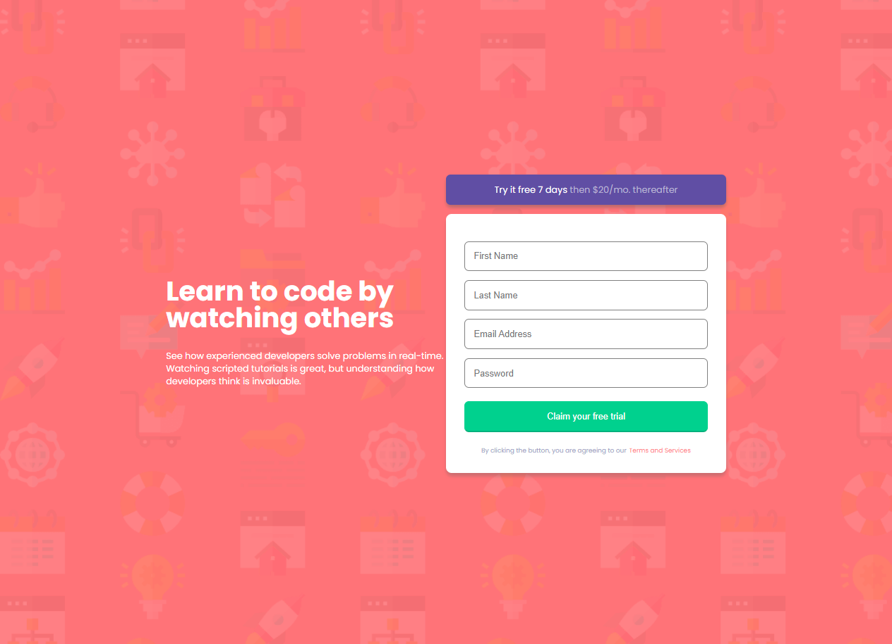
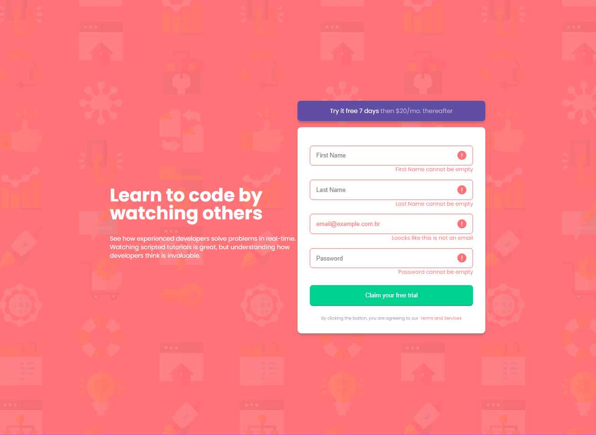
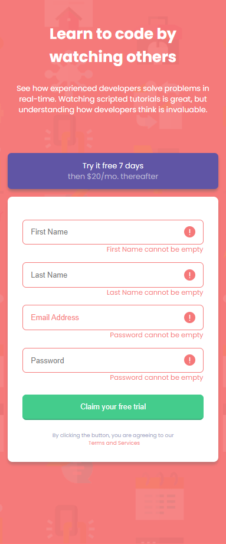

# Frontend Mentor - Intro component with sign up form

## Welcome! 👋

That's Frontend Mentor, a project that helps front-end programs evolve their skills.

## About the program
- Login form page
- Login form validation
- Page Responsiveness

[See the result live](https://vdr-crowley.github.io/Desafio_Formulario/)

[Check out my profile on Front-end Mentor](https://www.frontendmentor.io/profile/VDR-Crowley)

## Images of the finished project

    

 

    

 

    

 

    

